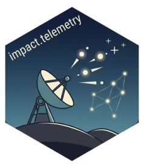

<!-- README.md is generated from README.Rmd. Please edit that file -->

```{r, include = FALSE}
knitr::opts_chunk$set(
  collapse = TRUE,
  comment = "#>",
  fig.path = "man/figures/README-",
  out.width = "100%"
)
```

# impact.telemetry 

<!-- badges: start -->
[](https://lifecycle.r-lib.org/articles/stages.html#experimental)
<!-- badges: end -->

The goal of impact.telemetry is to ...

## Installation

You can install the development version of impact.telemetry from [GitHub](https://github.com/) with:

``` r
# install.packages("pak")
pak::pak("ig-impact/impact.telemetry")
```

## Example

This is a basic example which shows you how to solve a common problem:

```{r example}
library(impact.telemetry)

log_file <- start_telemetry_logging()

log_add <- with_telemetry(function(a, b) {
  a + b
}, event_name = "add", log_args = TRUE, log_result = TRUE)

result <- log_add(1, 2)

result <- log_add(1, 20)
```

```{r}
lapply(readLines(log_file, n = 10), jsonlite::fromJSON)
```
